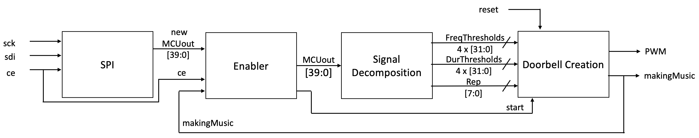

This system involves four independent systems working together: the RFID Reader, the MCU, the FPGA, and the speaker system. All must be designed independently, and then integrated together.

As the design of the speaker system is analog, it is not described in detail here. It simply involves a LM386 Audio Amplifier and an 8Ω speaker. The breadboard schematic of this system is shown in the [Documentation](https://joseph-q-zales.github.io/HMC-MicroPs-Final-Portfolio/doc/). 

Descriptions of the implementation and design of the MCU, RFID Reader, and FPGA follow.

## MCU Design

INSERT HERE.

## New Hardware: RFID Reader

Bought for this project was a PN532 RFID Reader. [^3] 

## FPGA Design

At a high level, the FPGA is sent a set of data from the MCU, creates a set of frequencies and durations from that data ,and outputs the corresponding pulse width modulation (PWM) signal. When that PWM signal is connected to a speaker, a set of notes are played. 

To do this, the FPGA code is divided into three cascading sections: data received, data decomposed into frequencies and a PWM driver output. A fourth section, the enabler, uses signals from other sections to determine when to pass the signals out of SPI and when to start the doorbell.

# FPGA Block Diagram

  

This block diagram illustrates a high-level view of the FPGA code. 

# Data Received from MCU
The first section, data received, is based on the SPI code from Lab 7 (implementing AES on an FPGA). For lab 7, 128-bits were sent to the FPGA via SPI, and after the FPGA had completed encrypting the data, it sent the encrypted data back. However, as the output of the FPGA goes to a speaker system instead of back to the MCU, the FPGA does not need to have the capability to send anything back via SPI to the MCU. From the MCU, the FPGA receives a 40-bit signal from which to decompose frequencies, durations and the number of times to repeat.

At its core, SPI is a shared shift register. This means that every signal input (a 1 or 0) shifts the previous inputs left by 1. Therefore, to create an SPI module on the FPGA, on the rising edge of the sck clock line from the MCU, a new bit of data was shifted into the register on the FPGA. At the end of 40 clock cycles (enough to push in the 40 bits), the chip enable (CE) goes from high to low signaling that the data can now be decomposed. 

# MCU Data Decomposed
The second section takes in the 5 8-bit signals and decomposes them. First, it bit swizzles the 40-bit signal into the frequencies, durations, and the number of times the tune repeats. See figure below for more details.

  

The decomposition of signals from what the MCU outputs through to the frequencies and durations generated by the FPGA.

From these sets of 4-bit signals, the frequencies must be chosen according to the input. For example, if tone0 is 0b0111, the corresponding output will be 440Hz (the note A4). However, the PWM driver takes thresholds as inputs, and so the frequency is mapped to such a threshold (more on this in the section below).

# Doorbell Creation
The last section, and heart of the program is the creation of the doorbell sound.

PWM driver. In comparison to using the PWM peripheral on a microcontroller, creating one from scratch on an FPGA is not a trivial task. 

# FPGA Diagrams

### FPGA Main FSM

  

Finite State Machine for the FPGA PWM Driver Logic.

### FPGA Block Diagram

  

testing testing 123

## FGPA stuff that we will need to have somewhere

Clockspeed 24 MHz.

| Note | Frequency (Hz) | Clock Strobe Threshold |
| ---- | ---- | ------ |
| A3 | 220 | 54,544 | 
| B3 | 247 | 48,582 | 
| C4 | 262 | 45,801 | 
| D4 | 294 | 40,815 | 
| E4 | 330 | 36,363 | 
| F4 | 349 | 34,383 | 
| G4 | 392 | 30,611 | 
| A4 | 440 | 27,272 | 
| B4 | 494 | 24,290 | 
| C5 | 523 | 22,944 | 
| D5 | 587 | 20,442 | 
| E5 | 659 | 18,208 | 
| F5 | 698 | 17,191 | 
| G5 | 784 | 15,305 | 
| A5 | 880 | 13,635 | 

| Duration (ms) | Clock Strobe Threshold |
| ---- | ---- | 
| 1000 | 2.4x10^10^ |
| 500 | 1.2x10^10^ |
| 250 | 6x10^9^ |

—--

[^3]:  INSERT REFERENCE.
