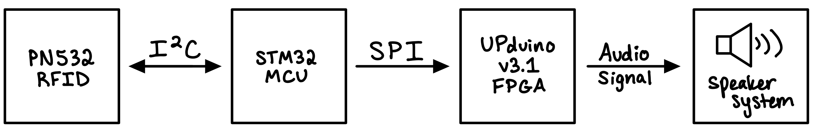

  

## Project Motivation
In our modern world, the Internet of Things has increasing relevance to everyday life. It seems like there is now a ‘smart’ product for every part of our day. This is everything from our cars recognizing our phones and setting preferences based on that to fridges that notify you when items are about to expire. 
Within the same PCB, many of these smart devices use I2C as it only requires two wires to send and receive data. 

In fact, the name itself is in reference to communicating between two integrated circuits (ICs).[^1]
Part of this growing expansion of devices interacting with our lives is the way they know who they are interacting with. One such way is using Radio Frequency Identification (RFID). While this technology has been around since the 1970s, recently this technology has entered our everyday lives. RFID has permeated our lives in everything from the Fastpass trackers for toll roads to tracking inventory in a warehouse to charging credit cards at a grocery store checkout (and swiping into dining halls at the 5Cs).[^2]

## Project Abstract
With these ideas in mind, we have a vision of an RFID doorbell. Tap your RFID card to the reader at the entryway to a house and the doorbell will announce your unique set of tones to the resident. Perhaps the resident uses this information to welcome you to their home. Perhaps they use this information to turn off all the lights and pretend they’re not home. Regardless of how an end user would take this functionality, having a bit more knowledge of who is at your front door could prove beneficial in this increasingly interconnected world.

To realize this vision, we designed the system block diagram below. A PN532 RFID Reader is the peripheral in an I2C communication link with a STM32 Microcontroller. This RFID Reader is programmed by the MCU to “listen” for ID taps, and when an ID is tapped to the board, transmit the data back to the MCU. The MCU then bit swizzles the ID data and algorithmically calculates 5 bytes of data that is unique to the ID data collected. The MCU acts as the controller in a SPI communication link with the UPduino v3.1 FPGA to send these 5 bytes. The FPGA is used as a PWM driver to then create an audio signal from these 5 bytes, which outputs to a speaker system. Because the ID data collected by the RFID Reader will always be the same for the same card and an algorithm is used to generate specific frequencies and note lengths, an ID card will always produce the same doorbell tune. Additionally, every new ID tapped produces its own doorbell tune.

**Everyone gets their own unique doorbell.**

## System Block Diagram

  

Block Diagram of RFID Doorbell System.

-------

[^1]:  “Advantages and Limitations of I2C Communication,” Total Phase Blog, August 31, 2016, https://www.totalphase.com/blog/2016/08/advantages-limitations-i2c-communication/.
[^2]: “How RFID Works,” HowStuffWorks, November 5, 2007, https://electronics.howstuffworks.com/gadgets/high-tech-gadgets/rfid.htm.
